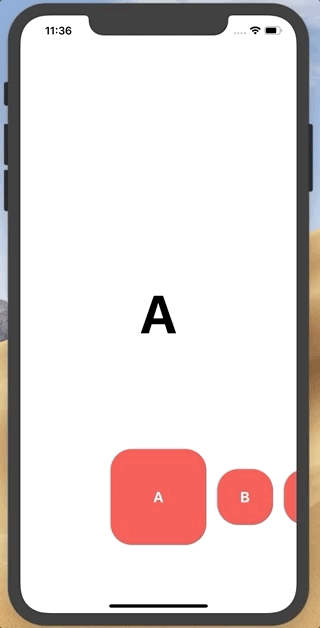

# SnapLikeCollectionView

## About

The collectionView library which is scaling, scrolling and stopping comfortably like Snapchat and Instagram.

|This|Instagram|Snapchat|
|:-:|:-:|:-:|
||||

## Requirements
Swift 4.2. Ready for use on iOS 11.0+

## Installation

### via Cocoapods

```ruby
pod 'SnapLikeCollectionView'
```

## Usage

### Cell

You should use **SnapLikeCell** protocol.

**Item** is associatedtype. You can apply any model you want.

This **Item** becomes dataSource's items.

```swift
public protocol SnapLikeCell: class {
    associatedtype Item
    var item: Item? { get set }
}
```

Below is example.

```swift
import UIKit
import SnapLikeCollectionView

class SampleCell: UICollectionViewCell, SnapLikeCell {
    @IBOutlet weak var titleLabel: UILabel!
    
    var item: String? {
        didSet {
            titleLabel.text = item
        }
    }
}
```

### ViewController

```swift
import UIKit
import SnapLikeCollectionView

class ViewController: UIViewController {
    @IBOutlet weak var titleLabel: UILabel!
    @IBOutlet weak var collectionView: UICollectionView!
    private var dataSource: SnapLikeDataSource<SampleCell>?
    
    override func viewDidLoad() {
        super.viewDidLoad()
        
        let cellSize = SnapLikeCellSize(normal: 100, center: 160)
        dataSource = SnapLikeDataSource<SampleCell>(collectionView: collectionView, cellSize: cellSize)
        dataSource?.delegate = self
        
        let layout = SnapLikeCollectionViewFlowLayout(cellSize: cellSize)
        collectionView.collectionViewLayout = layout
        
        collectionView.registerNib(SampleCell.self)
        collectionView.showsHorizontalScrollIndicator = false
        collectionView.decelerationRate = .fast
        collectionView.backgroundColor = .clear
        collectionView.delegate = dataSource
        collectionView.dataSource = dataSource
        
        dataSource?.items = ["A", "B", "C", "D", "E"]
    }
}

extension ViewController: SnapLikeDataDelegate {
    func cellSelected(_ index: Int) {
        DispatchQueue.main.async { [weak self] in
            let selectedItem: String = self?.dataSource?.items[index] ?? ""
            self?.titleLabel.text = selectedItem
        }
    }
}
```

## Author


**KBOY (Kei Fujikawa)**

iOS Developer in Tokyo Japan, working on AR startup named [Graffity Inc.](https://www.graffity.jp/)

- [Twitter](https://twitter.com/kboy_silvergym) / [Facebook](https://www.facebook.com/kei.fujikawa1)
- [LinkedIn](https://www.linkedin.com/in/kei-fujikawa) / [Wantedly](https://www.wantedly.com/users/17820205)

## License

SnapLikeCollectionView is available under the MIT license. See the LICENSE file for more info.
