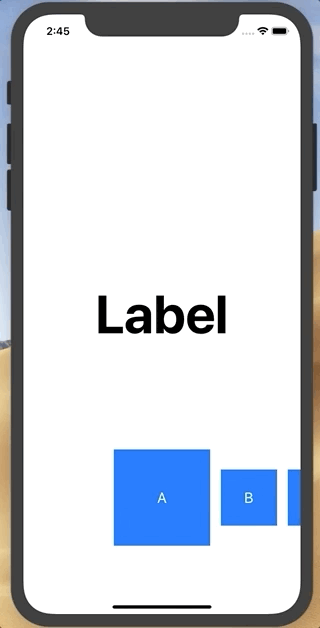

# SnapLikeCollectionView



## Usage

```swift
import UIKit
import SnapLikeCollectionView

class ViewController: UIViewController {
    @IBOutlet weak var titleLabel: UILabel!
    @IBOutlet weak var collectionView: UICollectionView!
    private var dataSource: SnapLikeDataSource<SampleCell>?
    
    override func viewDidLoad() {
        super.viewDidLoad()
        
        let cellSize = SnapLikeCellSize(normal: 100, center: 160)
        dataSource = SnapLikeDataSource<SampleCell>(collectionView: collectionView, cellSize: cellSize)
        dataSource?.delegate = self
        
        let layout = SnapLikeCollectionViewFlowLayout(cellSize: cellSize)
        collectionView.collectionViewLayout = layout
        
        collectionView.registerNib(SampleCell.self)
        collectionView.showsHorizontalScrollIndicator = false
        collectionView.decelerationRate = .fast
        collectionView.backgroundColor = .clear
        collectionView.delegate = dataSource
        collectionView.dataSource = dataSource
        
        dataSource?.items = ["A", "B", "C", "D", "E"]
    }
}

extension ViewController: SnapLikeDataDelegate {
    func cellSelected(_ index: Int) {
        DispatchQueue.main.async { [weak self] in
            let selectedItem: String = self?.dataSource?.items[index] ?? ""
            self?.titleLabel.text = selectedItem
        }
    }
}
```

## Requirements
- Swift 4.2

## Installation

```ruby
pod 'SnapLikeCollectionView'
```

## Author

Kei Fujikawa

## License

SnapLikeCollectionView is available under the MIT license. See the LICENSE file for more info.
